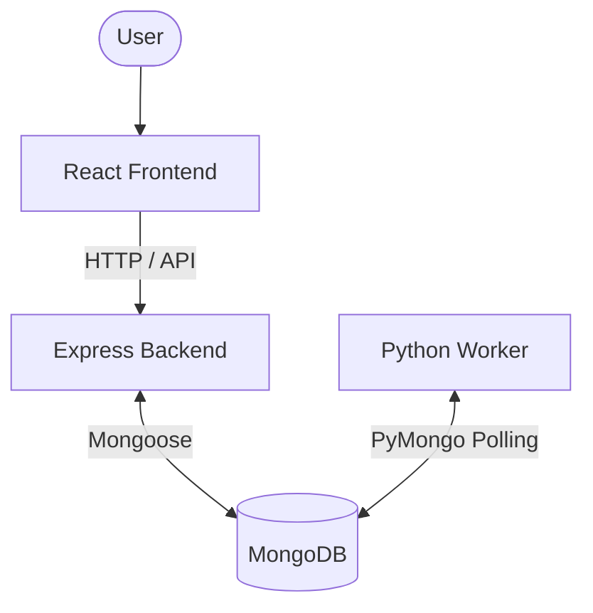
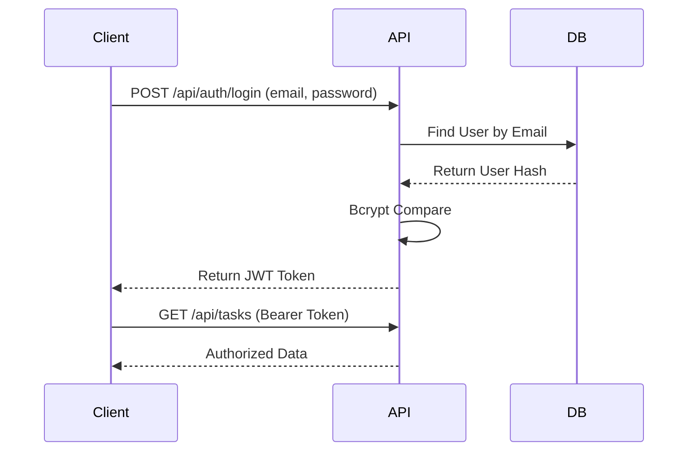
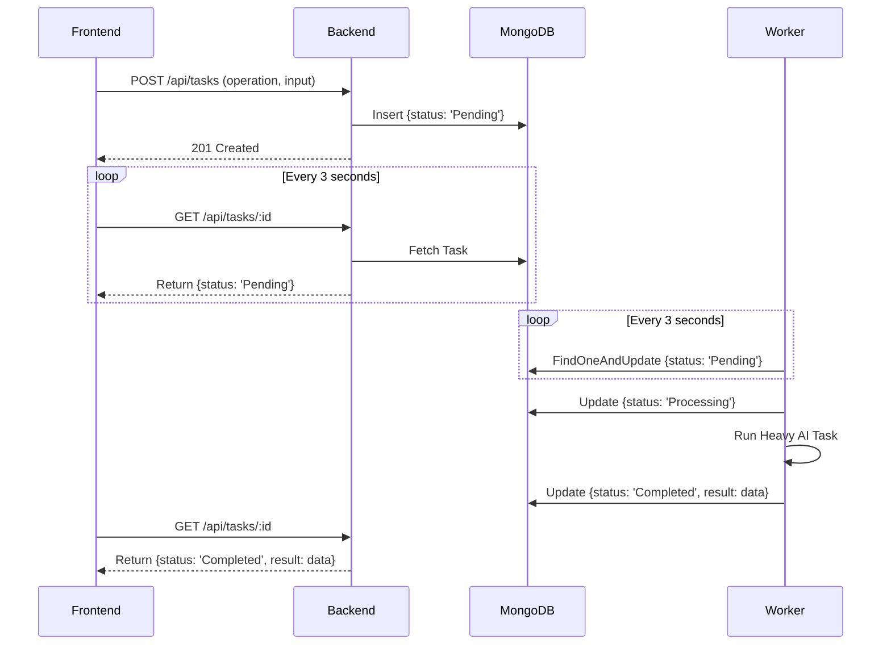
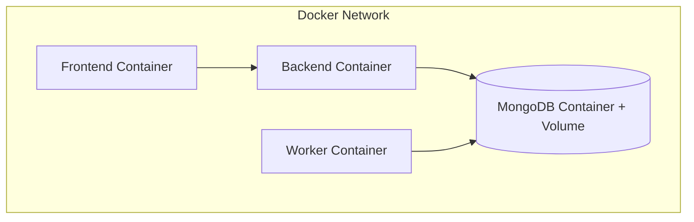
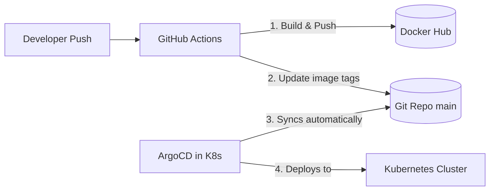

# Architecture Documentation

## High-Level Architecture

The platform follows a decoupled, microservice-inspired architecture designed to prevent expensive, long-running AI tasks from blocking the primary API server.



## Complete Request Flow

1. **User** submits a new Task via the Web Dashboard.
2. **React** sends a POST request to the Express API.
3. **Express API** validates the input and saves the Task to **MongoDB** with a `status: "Pending"`.
4. **Python Worker** continuously polls **MongoDB** and detects the "Pending" task.
5. The Worker updates the status to `Processing` and runs the heavy CPU operation.
6. The Worker saves the mock AI result back to **MongoDB** with `status: "Completed"`.
7. **Frontend Polling** detects the database change and updates the UI for the User dynamically.

## Component Breakdown

### Frontend (React)
- **Role**: SPA handling UI state and routing.
- **Mechanisms**: Uses JWTs for protected routes. Implements aggressive `setInterval` polling on the Task details page to check for background completion.

### Backend (Express)
- **Role**: RESTful API Gateway.
- **Mechanisms**: Handles authentication (bcrypt/JWT), data validation, and basic CRUD operations. It acts purely as a data-entry point and does not execute any AI logic itself.

### MongoDB
- **Role**: Primary data store and ad-hoc message queue.
- **Mechanisms**: Stores Users and Tasks. Used as the synchronization layer between the Node.js backend and Python worker.

### Python Worker
- **Role**: Background task processor.
- **Mechanisms**: Runs an infinite loop isolated from the web server. Features a robust `try-except` block to prevent service crashes during faulty task processing.

## Authentication Flow



## Task Processing Flow



## Deployment Architecture

### Docker
The application is containerized into four distinct services: `frontend`, `backend`, `worker`, and `mongodb`. A `docker-compose.yml` links them via a custom bridge network and ensures data persistence via volumes.



### Kubernetes (k3s)
Translates the Docker Compose setup into robust orchestrations:
- `Deployments`: Handles replica scaling (e.g., 2 Backend replicas) and self-healing.
- `Services`: `LoadBalancer` for Frontend, `NodePort`/`ClusterIP` for Backend and DB.
- `ConfigMaps & Secrets`: Environment variable injection.

```mermaid
graph TD
    subgraph Kubernetes Cluster (Namespace: shoppilot)
        Ingress/LB --> SVC_F[Frontend Service]
        SVC_F --> Pod_F[Frontend Pods]
        
        Pod_F --> SVC_B[Backend Service]
        SVC_B --> Pod_B[Backend Pods]
        
        Pod_B --> SVC_DB[MongoDB Service]
        Pod_W[Worker Pod] --> SVC_DB
        SVC_DB --> Pod_DB[(MongoDB Pod + PVC)]
    end
```

### GitOps Workflow (ArgoCD & GitHub Actions)

The deployment lifecycle is entirely automated using the principles of GitOps.


